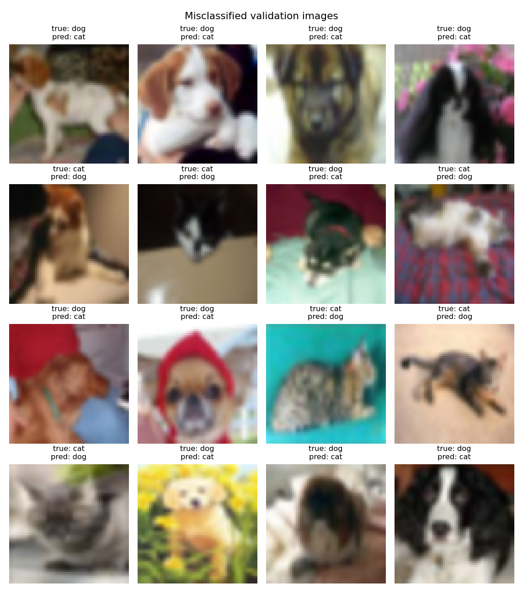
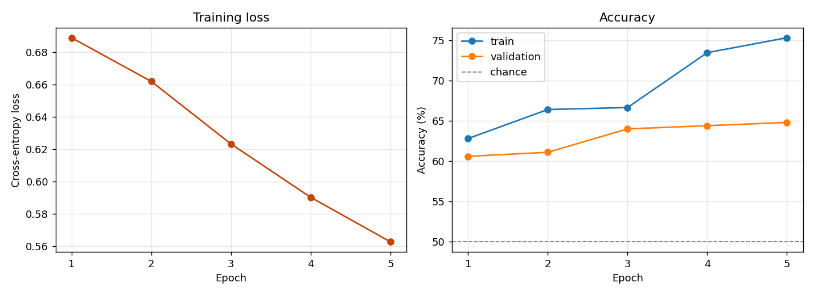

# Cats vs Dogs CNN

[](https://github.com/ronakrupani/cats-vs-dogs-cnn/actions/workflows/ci.yml)

A convolutional neural network written from scratch in PyTorch that classifies an image as a cat or a dog. No pretrained weights, no high-level wrapper library. Every layer is defined by hand so I could see exactly what the network is doing.

Trains on a CPU in a few minutes.



The validation images the model gets wrong. At 32x32 native resolution a lot of
these are genuinely hard to call.

## What it does

1. Downloads CIFAR-10 and keeps only the cat and dog images
2. Resizes them to 64x64 and normalizes pixel values to the -1 to 1 range
3. Runs them through a two-block CNN
4. Trains for 5 epochs, printing loss and accuracy each epoch
5. Saves the weights so you can classify your own photos afterwards

## Results

| | Accuracy |
|---|---|
| Validation (1000 images) | 64.8% |
| Random guessing | 50% |

Training set: 2000 images. Validation set: 1000 images. 5 epochs, batch size 32, Adam at lr 0.001, CPU only.



Loss falls steadily across all five epochs. Training accuracy climbs to 75.3%
while validation accuracy flattens out around 64.8%, and that widening gap is
the model starting to memorize the 2000 training images.

### Why the accuracy sits where it does

The original Google `cats_and_dogs_filtered` dataset went offline, so this uses the cat and dog classes from CIFAR-10 instead. Those images are 32x32 pixels natively. Upscaling them to 64x64 does not add detail that was never captured, so the ceiling here is set by the data, not by the architecture.

At 32x32 a cat and a dog are both a brown blob with ears. That is the honest reason this model lands where it does, and it is a more useful thing to understand than a higher number would have been.

## The architecture

| Stage | Shape out |
|---|---|
| Input | 3 x 64 x 64 |
| Conv 3x3, 3 to 16 channels, ReLU | 16 x 64 x 64 |
| Max pool 2x2 | 16 x 32 x 32 |
| Conv 3x3, 16 to 32 channels, ReLU | 32 x 32 x 32 |
| Max pool 2x2 | 32 x 16 x 16 |
| Flatten | 8192 |
| Dense, ReLU | 64 |
| Dropout 0.5 | 64 |
| Dense | 2 (cat, dog) |

About 530,000 parameters, and roughly 99% of them are in the first dense layer alone (8192 x 64). The convolutions carry almost none of the weight. That is the main thing I took away from building it by hand: the interesting work happens in the conv layers, but nearly all the memory sits in the flatten-to-dense jump. Swapping the flatten for a global average pool would cut the model by two orders of magnitude.

Dropout sits right before the output because that dense layer is where overfitting shows up first.

## Run it

```bash
pip install -r requirements.txt
python train.py
```

CIFAR-10 downloads itself the first time, about 170 MB, and is cached after that.

## Tests

```bash
pip install -r requirements-dev.txt
pytest
```

The suite runs in about a second and never downloads the dataset or trains.
It checks the forward pass shape, the preprocessing transform's range, the
parameter count quoted above, and that prediction returns a known label with a
probability. Randomly initialized weights are enough for all of that, since
these test the contract rather than the accuracy.

## Classify your own image

```bash
python predict.py path/to/photo.jpg
```

Returns the predicted class and a confidence score. The same resize, tensor, and normalize steps used in training are applied here, which matters: if the preprocessing differs between training and prediction, the numbers going into the network mean something different and the output is garbage.

## Layout

```
model.py           the SmallCNN definition and the shared transform
train.py           data loading, training loop, evaluation
predict.py         single-image inference
test_model.py      tests, no dataset needed
requirements.txt
requirements-dev.txt
```

## What I would do next

- Move to a full-resolution dataset (Oxford-IIIT Pet, or the Kaggle Dogs vs Cats set) at 128px, which is the change that actually lifts the ceiling
- Add random horizontal flips and crops so the model stops memorizing the training set
- Add batch normalization after each conv layer
- Fine-tune a ResNet18 on the same data and compare. The gap between a small network trained on 2000 images and a network pretrained on ImageNet is the whole point of transfer learning, and putting both numbers next to each other makes it concrete.

## License

MIT
